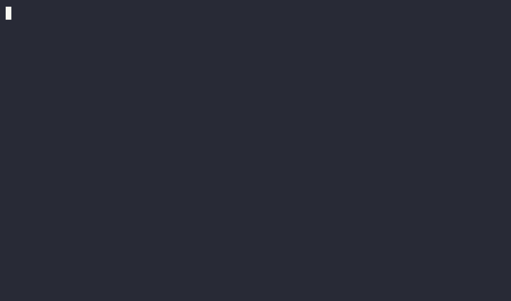

# agg-plus - asciinema gif generator with extra features

__agg-plus__ is a command-line tool for generating animated GIF files from
terminal session recordings. [__agg-plus__](https://github.com/d10n/agg-plus)
is a fork of [agg](https://github.com/asciinema/agg) with improved hinting, to
improve legibility at small font sizes, to reduce the need for bloated files,
as the agg maintainer [does not want this
feature](https://github.com/asciinema/agg/pull/117#issuecomment-4582661204).

It supports conversion from
[asciicast](https://github.com/asciinema/asciinema/blob/master/doc/asciicast-v3.md)
files produced by [asciinema recorder](https://github.com/asciinema/asciinema).
It uses Kornel Lesiński's excellent
[gifski](https://github.com/ImageOptim/gifski) library to produce optimized,
high quality GIF output with accurate frame timing.

Example GIF file generated with agg-plus:

| large resolution                                               |                                                               |
|----------------------------------------------------------------|---------------------------------------------------------------|
| `3.57 MiB`, 1529x902, AA default<br> | `2.75 MiB`, 1529x902, AA 3<br> |

| small resolution                                                   |                                                                    |
|--------------------------------------------------------------------|--------------------------------------------------------------------|
| `0.81 MiB`, 655x386, AA 3<br> | `0.65 MiB`, 655x386, AA 2<br> |

Notable features:

- conversion of [asciicast](https://docs.asciinema.org/manual/asciicast/v3/)
  recordings (v1, v2, v3) to animated GIF files,
- input from local files, stdin, or HTTP(S) URLs (e.g.
  [asciinema.org](https://asciinema.org) recording links),
- high-quality, optimized GIF output with accurate frame timing via the
  [gifski](https://github.com/ImageOptim/gifski) encoder,
- multiple built-in color themes (asciinema, dracula, monokai, github-dark,
  github-light, kanagawa, nord, solarized-dark, solarized-light, gruvbox-dark,
  and more),
- custom ad-hoc themes specified as hex color triplets,
- automatic use of the recording's embedded theme when present,
- configurable [font families](https://docs.asciinema.org/manual/agg/usage/#fonts)
  with sensible cross-platform defaults and implicit fallbacks for symbols,
  including automatic Nerd Font symbols rendering,
- configurable font size and line height,
- configurable font hinting and antialiasing,
- additional font directory support via `--font-dir` for fonts outside standard
  system locations,
- color emoji rendering with support for Apple Color Emoji, Noto Color Emoji,
  and other common emoji fonts,
- two selectable rendering backends: `swash` (default) and `resvg`,
- adjustable playback speed,
- idle time limiting to skip periods of inactivity,
- frame selection by time ranges, discrete positions, markers, percentages, and
  event indexes,
- looped or single-pass playback,
- configurable FPS cap and last-frame duration,
- terminal size override (cols/rows) for re-rendering at a different geometry.

Check out the [agg docs](https://docs.asciinema.org/manual/agg/) for
installation and usage overview.

## Installation

* Precompiled binaries for Linux and mac are available on the releases page at
  https://github.com/d10n/agg-plus/releases
* For Arch Linux, the AUR has
  [`asciinema-agg-plus`](https://aur.archlinux.org/packages/asciinema-agg-plus)
  and
  [`asciinema-agg-plus-bin`](https://aur.archlinux.org/packages/asciinema-agg-plus-bin)

## Building

Building from source requires [Rust](https://www.rust-lang.org/) compiler
(1.85.0 or later) and [Cargo package
manager](https://doc.rust-lang.org/cargo/). You can install both with
[rustup](https://rustup.rs/).

To download source code, build agg-plus binary and install it in `$HOME/.cargo/bin`
run:

```bash
cargo install --git https://github.com/d10n/agg-plus
```

You need to ensure `$HOME/.cargo/bin` is in your shell's `$PATH`.

Alternatively, you can manually download source code and build agg-plus binary with:

```bash
git clone https://github.com/d10n/agg-plus
cd agg-plus
cargo build --release
```

This produces an executable file in _release mode_ (`--release`) at
`target/release/agg-plus`. There are no other build artifacts so you can copy the
binary to a directory in your `$PATH`.

### Building with Docker

Alternatively, if you have Docker, Podman or another Docker-compatible tool
installed you can use it to build agg-plus container image. This doesn't require Rust
toolchain installed on your machine.

Build the image with the following command:

```sh
docker build -t agg-plus .
```

Then run agg-plus like this:

```sh
docker run --rm -u $(id -u):$(id -g) -v $PWD:/data agg-plus demo.cast demo.gif
```

If you use Podman in root-less mode:

```sh
podman run --rm -v $PWD:/data agg-plus demo.cast demo.gif
```

## License

Code from upstream is copyright © 2022 Marcin Kulik.
Improvements are copyright d10n and possible future agg-plus contributors.


All code is licensed under the GPL, v3 or later. See [LICENSE](./LICENSE) file
for details.
